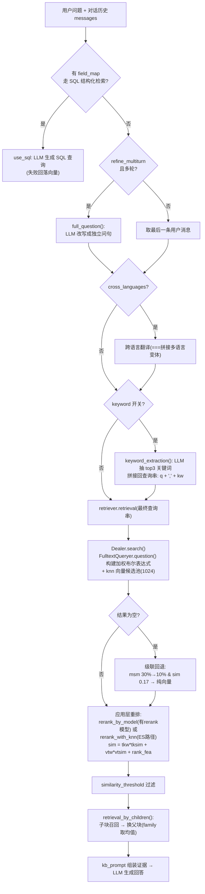
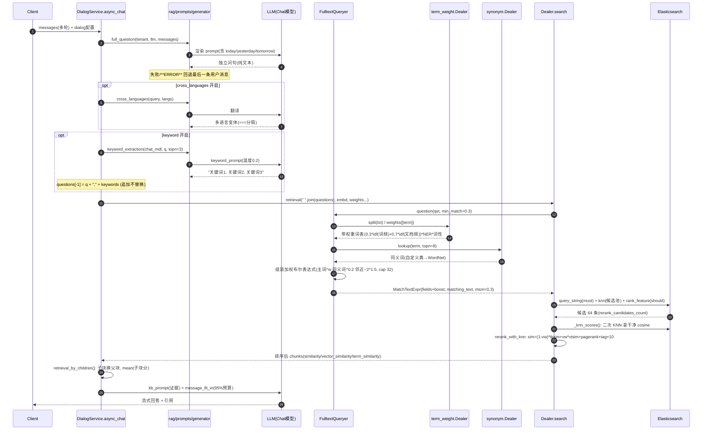
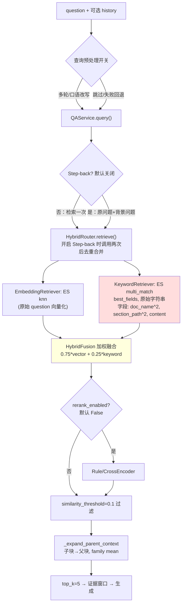

# RAGFlow 查询侧与关键词机制：源码分析、对比与实施

更新日期：2026-09-17。

- RAGFlow 源码版本：`infiniflow/ragflow@main`，commit `a6c722778837`（2026-09-17 拉取）。
- 本文所有 RAGFlow 结论均出自该 commit 的真实源码，标注了文件与方法；本项目结论出自当前工作区代码（`backend/src/`）。
- 维护规则：RAGFlow 行为以源码为准，本项目状态以代码和测试为准；两边任一侧变更后必须回写本文。

## 0. 本文回答的问题

原始疑问：

> 关键词如何提取？LLM 每轮提取生成的关键词也不一样啊，比如一个计算机网络的学习笔记，可能提炼出：计算机，网络，计网，底层，信号……总不能全都匹配一次吧。

三句话答案（后文逐层展开）：

1. **不存在"逐个匹配"**。RAGFlow 把所有关键词拼成**一次加权布尔查询**（`query_string`，OR 组合 + 每词带权重 + `minimum_should_match≈30%`）交给搜索引擎，单次打分完成，不是循环调用。
2. **泛词自动失效**。"计算机、网络"这类词在语料里到处出现，IDF 趋近于零，匹配了也几乎不加分；决定排序的是"滑动窗口、差错控制"这类稀有词。RAGFlow 用三层机制强化这一点（见 §1.2）。
3. **LLM 非确定性被四个设计消解**：索引侧一次性生成并缓存（查询时零 LLM 调用）、温度 0.2、"追加而非替换"原问题、向量通道 + 融合 + 重排兜底（见 §1.3）。

---

## 1. 核心机制：为什么"关键词不稳定"不是问题

### 1.1 一次加权布尔查询，不是循环匹配

RAGFlow 最终发给 ES 的关键词查询只有一个子句（`rag/utils/es_conn.py:250`）：

```python
bool_query.must.append(Q(
    "query_string",
    fields=m.fields,            # ["title_tks^10", ..., "important_kwd^30", "important_tks^20",
                                 #  "question_tks^20", "content_ltks^2", "content_sm_ltks"]
    type="best_fields",
    query=m.matching_text,      # 预构建的加权布尔表达式（见下）
    minimum_should_match="30%", # 由 0.3 格式化而来
    boost=1,
))
```

其中 `matching_text` 由 `FulltextQueryer.question()` 构建（`rag/nlp/query.py:42-168`），中文路径的最终形态类似：

```text
( (滑动窗口^0.35 OR (同义词组)^0.2 OR "滑 动 窗 口"~2^0.5) OR
  (网络^0.05 OR ...) ) OR ...
```

即：**所有词、同义词、细粒度子词、邻近短语一次性全部放进一个表达式**，ES 对每个文档只算一遍分。文档分数 ≈ Σ（命中的查询词 × 该词权重 × 所在字段 boost × 该词 IDF）。没有任何"逐关键词循环查询"。

`minimum_should_match="30%"` 的语义：文档至少要命中约三成查询词才有资格进入结果——这是"总不能全都匹配"的另一半答案：**既不需要全命中，也不允许零命中**（防止泛词拼凑出噪声结果）。

### 1.2 泛词为什么自动失效：三层机制

| 层 | 机制 | 出处 | 效果 |
|---|---|---|---|
| 存储层 | `*_tks` 字段使用自定义 `scripted_sim` 相似度：`score = boost × idf × min(doc.freq, 1)` | `conf/mapping.json` `similarity.scripted_sim` | **词频截断为 1**：一个词在一篇文档出现 1 次和 100 次贡献相同，彻底消灭堆词；打分退化为纯"加权投票" |
| 存储层 | `idf = log(1 + (docCount - docFreq + 0.5)/(docFreq + 0.5))` | 同上 | 语料级 IDF：计网笔记库里"计算机"docFreq≈全部文档 → IDF≈log(1)≈0 |
| 查询层 | 显式词权重 `term^w` 作为 boost | `rag/nlp/query.py` + `term_weight.py` | 与语料无关的通用词频典再压一次（见 §2.4 公式） |

用一个例子演算（数值为示意，量级真实）：

| 查询词 | 在"计网学习笔记"语料中的文档频率 | IDF 量级 | 对排序的作用 |
|---|---|---|---|
| 计算机 | ≈ 95% 文档 | ≈ 0 | 命中不加分 |
| 网络 | ≈ 90% 文档 | ≈ 0 | 命中不加分 |
| 计网 | ≈ 30% 文档 | 低 | 轻微 |
| 底层 | ≈ 20% 文档 | 中 | 有区分度 |
| 信号 | ≈ 5% 文档 | 高 | **主导排序** |
| 滑动窗口 | ≈ 1% 文档 | 极高 | **一票定音** |

所以"这轮抽到 [计算机, 网络]，下轮抽到 [计网, 底层]"的随机性，落在排序主体上几乎是同一次加权投票的扰动，稀有核心词（真正的区分项）两轮都会被抽出——LLM 抽词的方差集中在低 IDF 词上，天然无害。

### 1.3 LLM 非确定性的四个消解设计

| # | 设计 | 出处 | 说明 |
|---|---|---|---|
| 1 | 索引侧一次性生成 + LLM 缓存 | `rag/svr/task_executor.py:483-540` | `auto_keywords`/`auto_questions` 在**入库时**为每个块生成一次，结果以 `(模型名, 块内容, 类型, 参数)` 为键写入 LLM 缓存；同内容重入库命中缓存，**查询时完全不调用 LLM**。"每轮不一样"在索引侧不存在 |
| 2 | 低温 + 纯文本输出 | `rag/prompts/generator.py` `keyword_extraction` | 温度 0.2；查询侧抽词即便有方差，也只是"追加信号" |
| 3 | 追加而非替换 | `api/db/services/dialog_service.py:744-745`：`questions[-1] = questions[-1] + "," + await keyword_extraction(...)` | 原问题文本永远在；LLM 关键词只增不减。核心实体被双重命中（用户原话 + 规范词），泛词差异被 IDF 抹平 |
| 4 | 向量通道 + 融合 + 重排 + 级联回退 | `rag/nlp/search.py` | 关键词通道整体劣化时：向量通道不受影响；空结果触发 msm 30%→10%→纯向量的级联放宽（§2.6） |

---

## 2. RAGFlow 实现全景（源码级）

### 2.1 分层总览



### 2.2 查询预处理时序图



### 2.3 LLM 层：三个可选开关（`api/db/services/dialog_service.py:736-746`）

| 开关 | 触发 | 实现 | Prompt 要点 | 回退 |
|---|---|---|---|---|
| `refine_multiturn` | 用户消息 >1 条（取最近 3 条判断） | `full_question()` | 补代词省略为独立问句；相对日期按注入的 today/yesterday/tomorrow 转绝对；已完整则原样返回；只输出问句本身；3 组 few-shot（Trump 家人/天气） | `**ERROR**` 时回退最后一条用户消息 |
| `cross_languages` | 配置了目标语言 | `cross_languages()` | 产出多语言变体，`===` 分隔后拼接 | 出错返回原问题 |
| `keyword` | 开关开启 | `keyword_extraction(topn=3)` | "给文本 top-N 关键词，逗号分隔，同语言，只输出关键词"；温度 0.2 | 出错返回空串（查询串不变） |

注意两点：多轮改写**没有 token 预算与轮次裁剪**（全量 transcript 塞入）；关键词输出**不解析 JSON**，直接逗号分隔拼接。工程约束比我们项目的 `QueryRewriteService`（严格 JSON + 轮次分组 + 预算 + 注入防护）宽松。

### 2.4 统计层：`FulltextQueryer.question()`（`rag/nlp/query.py:42-168`）

处理流程：

```mermaid
flowchart TD
    T["输入查询串 txt"] --> CLEAN["清洗: 中英文字符间加空格<br/>去掉 ()^\"'~*?: 等 ES 语法字符<br/>繁转简/全角转半角/小写"]
    CLEAN --> WWW["rmWWW: 去掉 URL/邮箱等"]
    WWW --> LANG{"is_chinese?"}
    LANG -- "否(拉丁)" --> ENG["tokenize → tw.weights 每词带权重<br/>同义词按 权重/4 入短语<br/>相邻词组成 bigram 短语 ×2 权重<br/>cap 256 词"]
    LANG -- 是 --> CN["tw.split: 词权重切分成带权词组"]
    CN --> LOOP["对每个词组 tt (cap 256):"]
    LOOP --> W["tw.weights([tt]) 子词权重"]
    W --> SYN["syn.lookup(tt) 同义词"]
    SYN --> FG["≥3字且非纯ASCII → fine_grained_tokenize 细切"]
    FG --> CLZ["子句: (主词 OR (同义词)^0.2 OR 「细粒度串」 OR (「细粒度串」~2)^0.5)^w<br/>多子词时追加 (「整词 tokenize」~2)^1.5<br/>整组: (子句们)^5 OR (同义词)^0.7"]
    CLZ --> CAP["keywords 列表 cap 32 个"]
    CAP --> JOIN["词组间 OR 连接<br/>extra_options.minimum_should_match = 0.3"]
    ENG --> OUT["返回 MatchTextExpr(query_fields, 表达式, 100, opts), keywords"]
    JOIN --> OUT
```

**词权重公式**（`rag/nlp/term_weight.py:192-274`，纯离线统计，非 LLM）：

```text
weight(term) = ( 0.3 × idf(freq(term), N=10^7)      ← rag_tokenizer 内置词频典
              + 0.7 × idf(df(term),  N=10^9) )      ← rag/res/term.freq 文档频典
              × ner(term) × postag(term)
最后对所有查询词归一化（和为 1）
```

| 因子 | 规则 | 直觉 |
|---|---|---|
| `ner(term)` | 数字→2；1-2 字母→0.01；ner.json 标注：公司/地名/学校/股票→3，毒词→2，人名/功能词→1 | 型号编号是强信号 |
| `postag(term)` | 代词/连词/副词→0.3；地名/机构→3；名词→2；数字→2；其他→1 | "请问/怎么/啥"在停用词表直接删除 |
| OOV 兜底 | 未知字母词按长度估计频率 `300/2^((len-3)/2)`，下限 10 | 越长的生词越可能是专名 |
| 停用词 | 请问/您/你/我/他/是/的/什么/怎么/哪个/啥/相关… | 预处理直接滤除 |

**同义词三来源**（`rag/nlp/synonym.py`）：`rag/res/synonym.json` 静态词典 → Redis `kevin_synonyms`（每小时热更，运营可调）→ 纯英文词回退 WordNet。查询里同义词一律降权使用（`^0.2`/`^0.7`/权重÷4），**主词永远比同义词响**，防止错误同义扩散。

### 2.5 存储层：mapping 的三个关键决策（`conf/mapping.json`）

| 决策 | 内容 | 目的 |
|---|---|---|
| 写入/查询两侧统一分词 | 入库时所有 `*_tks` 字段存 `rag_tokenizer.tokenize()` 的空格分隔结果；查询时同一 tokenizer 切词；字段 analyzer 固定 `whitespace` | **分词一致性**是关键词检索的正确性前提：索引侧和查询侧看到同一组 token |
| 自定义相似度 | `*_tks` 用 `scripted_sim`：`boost × idf × min(doc.freq,1)` | TF 截断，防堆词；打分=加权投票，可解释 |
| kwd/tks 双轨 | `important_kwd` 等 `*_kwd` 是 keyword 精确字段（整短语精确匹配，boost 30）；`important_tks` 是分词字段（token 交叉匹配，boost 20） | 精确匹配和模糊匹配分开计价 |

### 2.6 检索融合、重排与级联回退（`rag/nlp/search.py`）

**两通道的关系（ES 后端，与我们同栈）**：

- `retrieval()` 里 `min_match = vector_similarity_weight < 0.8`（search.py:773）→ 用户向量权重 <0.8 时文本查询带 `msm=0.3` 进 `must`，即**关键词命中是准入门槛**；
- ES 路径的 `FusionExpr` 权重固定 `"0.001,1"`（search.py:331），`es_conn.py:251` 据此把文本查询 boost 设为 `1-1=0`——**ES 层文本不参与最终分数**，只做门槛+召回；
- **权威排序在应用层重排**：`rerank_with_knn()`（search.py:604）：

```text
sim = (1-vw) × tksim + vw × vtsim + pagerank + tag余弦×10

其中 tksim 由 token_similarity 计算（query.py:180-195）：
  文档 token 池 = content_tks + title_tks×2 + important_kwd×5 + question_tks×6
  query 侧 unigram 权重×0.4 + 相邻 bigram 权重×0.6
  tksim = Σ(被文档命中的 query 权重) / Σ(query 全部权重)
```

`question_tks×6` 是全场最高放大系数——RAGFlow 把"索引侧预演用户问法"的价值压到最重。有 rerank 模型时走 `rerank_by_model()`：cross-encoder 对**原文**（`content_with_weight`，非切词字段）打分，token 池不再重复放大（"duplicating a field would distort the model's own scoring"，search.py:678-681）。

**空结果级联回退**（search.py:340-400）：

| 顺序 | 动作 | 语义 |
|---|---|---|
| 1 | 纯向量场景：knn `similarity` 阈值 0.1→0.17 | 放宽向量门槛 |
| 2 | 有 doc_id 过滤：去掉全部 match 表达式 | 在指定文档内全文浏览 |
| 3 | 混合场景：`msm 0.3→0.1` + knn similarity 0.17 | 放宽关键词门槛 |
| 4 | 仍为 0 且原本有文本匹配：**去掉文本子句，纯向量兜底** | 承认查询理解可能全盘失败 |

**其他特征**：`rank_feature` 以 `should` 子句追加 Pagerank 与标签特征；`label_question()`（`rag/app/tag.py`）把问题在"标签知识库"里检索出 top 标签，作为查询侧特征与 chunk 的 `tag_kwd` 做点积（归一化后 ×10）。

### 2.7 索引侧：入库时一次性生成（`rag/svr/task_executor.py:483-540`）

```python
# auto_keywords（默认 0，用户在知识库配置里开启，通常 3）
cached = get_llm_cache(chat_mdl.llm_name, d["content_with_weight"], "keywords", {"topn": topn})
if not cached:
    async with chat_limiter:                          # 全局并发限制
        cached = await keyword_extraction(chat_mdl, d["content_with_weight"], topn)
    set_llm_cache(...)                                # (模型, 内容, 类型, 参数) 四元组缓存
d["important_kwd"] = cached 按逗号分词
d["important_tks"]  = rag_tokenizer.tokenize(" ".join(important_kwd))

# auto_questions 同构 → question_kwd(按行分) + question_tks
```

要点：**生成一次、随块持久化、查询时零 LLM 调用**；缓存保证同内容重入库结果一致；并发受 `chat_limiter` 限流；失败则该块无该字段（检索侧自然降级），不阻塞入库。

#### 2.7.1 生成器与 Prompt 原文

RAGFlow 的"关键词"共有 **3 个 LLM 生成器 + 1 个统计生成器**：

| 生成器 | 触发 | 输入 | 输出与解析 | 缓存 |
|---|---|---|---|---|
| `important_kwd`（入库） | 知识库配置 `auto_keywords`（默认 0，常设 3） | chunk 正文 | 逗号分隔短语 → `re.split(r"[,，;；、\r\n]+")` | 是 |
| `question_kwd`（入库） | 知识库配置 `auto_questions`（默认 0，常设 3） | chunk 正文 | 每行一个问题 → `split("\n")` | 是 |
| 查询侧关键词 | 对话配置 `keyword` 开关 | 改写后的问题 | 逗号分隔 → 拼接回查询串 | 否（每次查询） |
| 统计词权重（非 LLM） | 每次检索自动执行 | 查询串 | 带权重词表（§2.4 公式），纯查表，零随机 | 不需要 |

`keyword_prompt.md` 原文（索引侧与查询侧共用）：

```text
## Role
You are a text analyzer.

## Task
Extract the most important keywords/phrases of a given piece of text content.

## Requirements
- Summarize the text content, and give the top {{ topn }} important keywords/phrases.
- The keywords MUST be in the same language as the given piece of text content.
- The keywords are delimited by ENGLISH COMMA.
- Output keywords ONLY.

## Text Content
{{ content }}
```

`question_prompt.md` 原文：

```text
## Task
Propose {{ topn }} questions about a given piece of text content.

## Requirements
- Understand and summarize the text content, and propose the top {{ topn }} important questions.
- The questions SHOULD NOT have overlapping meanings.
- The questions SHOULD cover the main content of the text as much as possible.
- The questions MUST be in the same language as the given piece of text content.
- One question per line.
- Output questions ONLY.

## Text Content
{{ content }}
```

调用细节（`rag/prompts/generator.py` `keyword_extraction`）：system = 渲染后 prompt，user = 固定的 `"Output: "`（诱导直接输出），温度 0.2；输出**不解析 JSON**，靠分隔符切分。缓存（`rag/graphrag/utils.py`）：键 = `xxhash64(模型名 + 内容 + 类型 + 参数)`，Redis 存储，TTL 24 小时。

与我们 `RetrievalMetadataGenerator` 的对照：

| 维度 | RAGFlow | 我们（方案保留、未接线；旧孤立实现已清理） |
|---|---|---|
| 调用次数 | 关键词、问题各一次（两调用两 prompt） | **一次调用**同时产出两类（JSON schema） |
| 输出格式 | 自由文本（逗号/换行分隔） | 严格 JSON + schema 校验 + fence 剥离 |
| 输入上下文 | 只给 chunk 正文 | 文档名 + 章节路径 + 正文前 2000 字 |
| 数量约束 | topn=3（配置） | important 3-12、question 2-6 + 去重 |
| 失败回退 | 无（该块无字段，检索侧静默降级） | **规则回退**：文档名×3/章节×2.5 的短语 Counter + 模板问题 |
| 结果缓存 | Redis 24h，重入库不重复调用 | 无（重入库会重复调用，待补） |

### 2.8 父子召回：`retrieval_by_children`（search.py:1085-1139）

子块命中 → 按 `mom_id` 分组 → 取父块全文、`similarity = mean(子块分)`、合并子块 `important_kwd`；父块查不到回落子块本身。**与我们 `HybridRouter._expand_parent_context` 的 family-mean 语义一致**（我们多了 `matched_children` 明细和 parent_lookup_failed 追踪，属于加强）。

---

## 3. 本项目现状（2026-09-17 首次核查，2026-09-21 更新查询侧状态）



红色节点是与 RAGFlow 差距的核心。逐项核查结论：

| # | 事实 | 证据 |
|---|---|---|
| 1 | **`RetrievalMetadataGenerator` 是孤儿代码**：`important_kwd/question_kwd/title_tks/important_tks/question_tks` 目前**从未写入 ES**。`EmbeddingIndexer.index()` 只写 embedding 相关字段 | `backend/src/indexing/embedding_indexer.py`（全文件无调用）；全仓 grep 仅定义处引用 |
| 2 | BM25 只查 `doc_name^2, section_path^2, content` 三个原始字段；mapping 里预留的 tks 字段不参与检索 | `backend/src/infrastructure/elasticsearch_store.py:8-12` |
| 3 | 查询串**原样**进 `multi_match`，无分词预处理、无 `minimum_should_match`、无同义词、无显式词权重 | `elasticsearch_store.py:195-234` |
| 4 | tks 字段用默认 `standard` 分词器：中文拆单字。**两侧一致**（存储的 token 列表也被 standard 拆成单字），所以是"能用的单字匹配"，不是错配 | `_base_mapping()` |
| 5 | `QueryRewriteService` 已接入 `QAService`：请求可传 `history` 做多轮指代消解，无历史时可按请求开启口语规范化；失败回退原问题，Trace 记录结果与耗时。Step-back 也已作为默认关闭的实验开关进入主链 | `backend/src/apps/services/query_rewrite.py`、`backend/src/apps/services/qa_service.py`、`backend/src/apps/restful_apis/qa.py` |
| 6 | 两通道**独立软融合**（加权求和），无文本准入门槛，无空结果级联回退 | `hybrid_router.py` / `hybrid_fusion.py` |
| 7 | `_expand_parent_context` 与 RAGFlow `retrieval_by_children` 语义对齐（family mean），已加强 | `hybrid_router.py:46-170` |
| 8 | `vectorizer.tokenize`：中文单字+bigram、去停用字，query_terms 再滤"介绍/请问/一下"等 | `backend/src/retrieval/vectorizer.py` |

**修正记录**：2026-09-17 早些时候的对话曾表述"question_tks 已生成入库、只是检索字段没接"——经本次全链路核查，生成器从未被调用，实际状态是"**既未生成、也未检索**"。以本文为准。

---

## 4. 修改方案

总原则：与 `docs/plan/README.md` 一致——每步可独立验证、评测准入、不为模仿而堆功能。P0 两步互为前提（先有数据再接检索），一起构成一个最小可评测单元。

> **状态（2026-09-21）**：§4.1-4.3（索引侧方案 A/B/C，元数据接线）继续暂缓，方案只作备查——RAGFlow 同类开关 `auto_keywords`/`auto_questions` 默认关闭，逐子块 LLM 成本与收益未经评测证明，当前 Golden Set 也没有给出必须接线的失败证据。查询侧的“独立问题改写”已经进入生产主链，但 §4.4 的“额外关键词输出并只追加到 BM25”尚未实现；§4.5 级联回退也尚未实现。本文编号是对比方案内部编号，不等同于项目全局 P0/P1/P2。

### 4.1 索引侧方案 A：接线索引侧元数据生成（先有字段）

`EmbeddingIndexer` 增加 `RetrievalMetadataGenerator`（`from_env()` 已有开关与回退），只对 `retrieval_eligible` 子块生成：

```python
# backend/src/indexing/embedding_indexer.py（草案）
def __init__(self, ..., metadata_generator=None):
- doc2query 方案尚未接入当前生产链路；旧孤立生成器及其环境配置已删除。后续评测证明需要时，再通过统一模型入口实现。

# index() 内，对每个 eligible 子块：
generated = self._metadata.generate(doc_name, {
    "content": chunk.page_content,
    "section_path": chunk.metadata.get("section_path", []),
})
metadata.update({
    "important_kwd": generated["important_kwd"],
    "important_tks": generated["important_tks"],
    "question_kwd": generated["question_kwd"],
    "question_tks": generated["question_tks"],
    "title_tks": generated["title_tks"],
})
```

约束：LLM 不可用时生成器内部回退规则版（`metadata_source: "rule"` 已有 trace）；老文档需重入库才有字段（走现有 reingest 流程）。**可加 RAGFlow 式的 (模型, 内容, 参数) 结果缓存**（SQLite 即可）避免重入库重复付费，P1 再做。

**成本与适用范围（2026-09-17 补充，回应"每 Child 一次 Chat 是否可承受"）**：

- "每子块一次 Chat"只发生在**业务入库链路**（`ingestion_pipeline → EmbeddingIndexer`）。T2 评测链路（`benchmark_adapter`）直接用 `EmbeddingTextBuilder` 构造 embedding 输入，**不经过 EmbeddingIndexer**——81k 子集与任何规模的评测语料都不会触发 LLM 元数据生成。
- doc2query 方案尚未接入当前生产链路；旧孤立生成器及其环境配置已删除。后续评测证明需要时，再通过统一模型入口实现。
- 若将来确需对大规模语料开 LLM 版：元数据提取是简单任务，用免费/低价档模型（如 glm-4-flash 级别）；按 Parent 生成再下发子块（父子比约 1:8，调用数降一个量级）；或单次调用批量处理多个子块（牺牲缓存粒度）。逐块调用（RAGFlow 原样）是精度与缓存粒度最优解，不是成本最优解。

### 4.2 索引侧方案 B：BM25 接入增强字段（字段真正参与检索）

```python
# backend/src/infrastructure/elasticsearch_store.py（草案，第一阶段：standard 版，零重建）
_KEYWORD_FIELDS = [
    "question_tks^3",
    "important_tks^3",
    "title_tks^2",
    "doc_name^2",
    "section_path^2",
    "content",
]
```

- 为什么可行：现状是 standard 分词器、两侧一致（§3-#4），tks 字段里存的单字/bigram 会被拆成单字参与倒排，与查询串的单字对得上，**不重建索引即可生效**。
- boost 取值（3/3/2 对正文 1）是保守起点，RAGFlow 用 20/20/10 的前提是它有 `min(doc.freq,1)` 相似度防堆词；我们没有，先小幅放大，评测后再调。
- `minimum_should_match`：**第一阶段不加**（避免中文单字场景误杀短查询），列入扫描参数（与计划 P0 的 candidate_top_k/threshold 扫描合并做）。
- 命中可观测：trace 里已有 `important_kwd/question_kwd` 展示，补充一个 `keyword_trace.matched_fields`（来自 ES `named queries` 或 explain 抽样）用于判断增强字段是否真的在贡献。

### 4.3 索引侧方案 C：评测（改动生效的准入条件）

在 T2 子集 + 业务 Golden Set 的两个切片上 A/B：

| 切片 | 验证什么 | 指标 |
|---|---|---|
| 同义词和口语问题（8 条） | 增强字段+问题变体的核心价值 | Recall@5、MRR@10 |
| 型号、数字、专有名词（5 条） | BM25 本职，防回归 | Recall@5、MRR@10 |
| 其余切片 | 防整体劣化 | 全量 Recall/MRR |

报告进 `evaluation/reports/`，失败则回退 `_KEYWORD_FIELDS`（一行改动，可安全回滚）。

### 4.4 查询侧方案 A：关键词提取合并进改写（一次 LLM 调用）

RAGFlow 用两次调用（改写 + 抽词），我们合并为一次，输出扩展为：

```json
{"standalone_query": "计算机网络里滑动窗口协议怎么控制流量", "keywords": ["滑动窗口", "流量控制", "协议"]}
```

当前 `QueryRewriteService` 已在 `QAService.query()/query_stream()` 开头接线，输出独立问题并用于检索与回答；本节剩余候选是把输出扩展为 `keywords`，随后：

- **关键词通道**查询串 = `standalone_query + ", " + ", ".join(keywords)`（RAGFlow 式追加）；
- **向量通道只用 `standalone_query`**，不拼关键词——RAGFlow 把拼接串也拿去 embedding（`dialog_service.py:758` 的 `" ".join(questions)` 同时进 `get_vector`），这点我们不做，保持向量通道语义干净；
- 失败回退：改写失败用原问题（已有逻辑），抽词失败不加关键词。

### 4.5 查询侧方案 B：空结果级联回退

`HybridRouter.retrieve()` 尾部，`eligible_rows` 为空时依次：

1. `similarity_threshold` 减半重过滤（不重查 ES，便宜）；
2. keyword 通道 `minimum_should_match` 降级重查一次（若已启用 msm）；
3. 纯向量通道兜底；
4. 仍为空 → 正常返回空，由 P0 的 `no_evidence` 语义接管（而不是业务报错）。

每次回退记录 `fallback_reason` 进 trace（字段已有，模式已有——rerank 失败就是这么做 的）。

### 4.6 明确不抄的部分（及理由）

| 项 | 理由 |
|---|---|
| `term_weight.py` 显式词权重 | ES BM25 自带语料级 IDF，等价且零维护；RAGFlow 需要它是因为要在应用层重排里用 token 权重 + 自定义相似度 |
| `scripted_sim`（TF 截断） | 有价值但属于"单字+泛词噪声"确诊后的处方；先靠 msm + 评测定位 |
| 同义词三件套 | 需要词表运营；向量通道天然扛同义，Golden Set 同义词切片不达标再上（P2） |
| `label_question` 标签特征 / Pagerank / tag | 需要标签库和链接图，超出当前产品形态 |
| ES 层文本准入门槛（must+msm） | 与我们“独立软融合”是两种取舍；RAGFlow 靠级联回退补偿门槛的误杀。我们保持软融合，只有失败切片证明有必要时再与 Weighted RRF 一起评测 |
| `cross_languages` / `toc_enhance` / `use_kg` / `sca_query_rewrite` | 无多语言场景；KG/TOC/多跳研究已在计划中明确 P2/暂不做 |

---

## 5. 借鉴决策总表

| # | RAGFlow 功能 | 实现要点（源码） | 我的项目现状 | 决策 | 优先级 | 理由/风险 |
|---|---|---|---|---|---|---|
| 1 | 索引侧关键词+问题生成 | `auto_keywords/auto_questions` + LLM 缓存 + 限流 | 生成器已写、**未接线** | ⏸ 条件借鉴 | 失败证据触发 | 逐 Child 调用成本高，当前 Golden Set 未证明缺口；方案见 §4.1 |
| 2 | BM25 增强字段（7 字段 boost） | `query_fields` 表（§2.1） | 只查 3 个原始字段 | ⏸ 与 #1 联动 | 失败证据触发 | 没有元数据写入时单独加字段无效；方案见 §4.2 |
| 3 | `minimum_should_match` | 0.3 常规 / 0.1 回退 / vw≥0.8 时关闭 | 无 | ⏸ 条件借鉴 | 与 BM25 失败切片一起评测 | 中文单字场景可能误杀短查询，不先验上线 |
| 4 | 空结果级联回退 | msm 降级→阈值放宽→纯向量 | 无 | ✅ 借鉴 | P1 | §4.5；与 `no_evidence` 协议衔接 |
| 5 | 查询侧 LLM 关键词抽取（追加式） | `keyword_extraction` 逗号拼接 | 无；基础独立问题改写已接线，但未输出额外关键词 | ⏸ 条件借鉴 | 失败证据触发 | §4.4；在现有改写 schema 上扩展，必须证明 BM25 切片收益 |
| 6 | 多轮查询改写 | `full_question` 纯文本+全量历史 | 已接同步/SSE 主链；请求传 `history`，完整轮次裁剪、严格 JSON、预算、防注入、失败回退和 Trace 均已实现 | ✅ 已实现核心链路 | P1 继续产品化 | 剩余 Conversation/Message/session_id、歧义澄清和收益评测 |
| 7 | 写入/查询两侧统一分词 + whitespace analyzer | tokenize 两侧一致 | standard 单字，两侧一致 | ✅ 借鉴 | P1（#2 评测后） | 消单字噪声；需重建索引，挂 `index_schema_version` 升版 |
| 8 | 父子召回 family-mean | `retrieval_by_children` | `_expand_parent_context` 已对齐且更细 | ✅ 已完成 | — | 无行动 |
| 9 | 融合：ES 层门槛+0分文本，应用层加权重排 | §2.6 | 独立软融合（加权求和） | ⏸ 观望 | 与 Weighted RRF A/B 合并决策 | 两种取舍各有代价，用评测说话 |
| 10 | 应用层 token 重排（字段放大 ×2/×5/×6） | `rerank_with_knn` | 无（有加权融合） | ⏸ 部分 | P2 | 依赖词权重体系；cross-encoder rerank 优先级更高（计划 P0/P1） |
| 11 | 同义词（静态典+Redis+WordNet） | `synonym.Dealer`，降权使用 | 无 | ⏸ 条件借鉴 | P2 | 向量通道扛同义；失败数据触发 |
| 12 | `scripted_sim` TF 截断相似度 | `conf/mapping.json` | 无 | ⏸ 条件借鉴 | P2 | 确诊堆词/泛词问题后上 |
| 13 | 显式统计词权重 `term_weight` | 离线典+NER+词性 | 无 | ❌ 不借鉴 | — | ES BM25 IDF 隐式等价，双份冗余 |
| 14 | 标签特征/Pagerank/`label_question` | tag 知识库+rank_feature | 无 | ❌ 不借鉴 | P2+ | 运营成本超产品形态 |
| 15 | `cross_languages` | 多语言变体拼接 | 无 | ❌ 不借鉴 | P2+ | 无场景 |
| 16 | TOC/KG/多跳 `sca_query_rewrite` | advanced_rag | 无 | ❌ 不借鉴 | P2+ | 计划已明确暂缓；作面试"演进方向"素材 |

---

## 6. 与主计划的联动

`docs/plan/README.md` 是唯一优先级总表。本文只保存 RAGFlow 源码对照和候选方案：

1. 索引侧元数据与 BM25 增强字段仍是条件方案；失败切片触发后实施 §4.1-4.3，并把 A/B 结果回写主计划。
2. 多轮独立问题改写已经接入；§4.4 只剩“单次调用额外输出关键词，并只追加到 BM25”的候选扩展。
3. 向量通道继续只编码干净的独立问题，不拼接关键词；是否改变必须单独做 A/B。
4. `RetrievalMetadataGenerator` 仍属于未进入主链的组件，不得在项目介绍中表述为已上线能力。

## 7. 面试口径（一段话）

> "用户问法和原文不一致是 vocabulary mismatch。RAGFlow 会在入库时为 chunk 生成关键词和可能问法，查询时再追加 LLM 关键词，并配合多字段 boost、`minimum_should_match` 与级联回退。我的项目先用向量+BM25 基线做了真实评测，没有发现必须承担逐 Child LLM 成本的证据，所以索引侧元数据方案只保留设计，没有伪装成已上线能力；当前已落地的是请求侧独立问题改写、可选口语规范化和默认关闭的 Step-back。改写后的干净问题进入向量与 BM25，额外关键词追加仍需失败切片证明收益后再做。"
